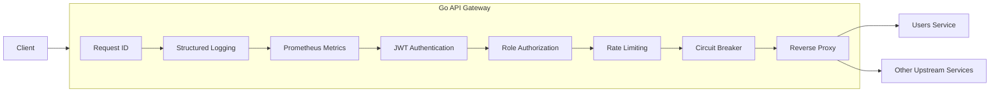

# Go API Gateway

[](https://github.com/ErenKarakus1/API-Gateway/actions/workflows/ci.yml)


An API Gateway built with Go and Gin. The project demonstrates practical backend infrastructure patterns: config-driven reverse proxying, JWT authentication, role-based authorization, rate limiting, timeout handling, retries, circuit breaking, structured logs, Prometheus metrics, and a Docker Compose demo environment.

## Features

- Config-driven route forwarding
- Health and readiness endpoints
- Request IDs and structured logging
- JWT authentication
- Role-based authorization
- Per-route rate limiting
- Redis-backed distributed rate limiting
- Upstream timeout handling
- Upstream retry handling
- Circuit breaker protection
- Standardized JSON error responses
- Prometheus metrics
- Docker Compose demo environment
- Gateway and middleware tests

## Architecture



The gateway reads route definitions from YAML and registers matching Gin routes at startup. Each configured route can define its upstream URL, allowed methods, auth requirements, roles, rate limit, circuit breaker, timeout, and retry policy.

## Getting Started

```bash
go run ./cmd/gateway
```

The gateway starts on `http://localhost:8080`.

```bash
curl http://localhost:8080/health
curl http://localhost:8080/ready
curl http://localhost:8080/metrics
```

## Docker Demo

```bash
docker compose up --build
```

The Compose demo starts the gateway on `http://localhost:8080` and a mock users service behind it.

Generate a demo JWT and call the protected users route:

```bash
TOKEN=$(go run ./cmd/token -secret change-me-in-production -sub user-123 -roles user)
curl -H "Authorization: Bearer $TOKEN" http://localhost:8080/api/users
```

## Demo Walkthrough

Start the gateway and mock users service:

```bash
docker compose up --build
```

In another terminal, check the gateway health endpoints:

```bash
curl http://localhost:8080/health
curl http://localhost:8080/ready
```

Try the protected route without a token:

```bash
curl http://localhost:8080/api/users
```

Generate a valid token:

```bash
TOKEN=$(go run ./cmd/token -secret change-me-in-production -sub user-123 -roles user)
```

Call the protected users route:

```bash
curl -H "Authorization: Bearer $TOKEN" http://localhost:8080/api/users
curl -H "Authorization: Bearer $TOKEN" http://localhost:8080/api/users/1
```

Inspect Prometheus metrics:

```bash
curl http://localhost:8080/metrics
```

Stop the demo:

```bash
docker compose down
```

## Configuration

The default config lives at `config/gateway.yaml`.

```yaml
server:
  port: "8080"

auth:
  jwt_secret: "change-me-in-production"

redis:
  enabled: false
  address: localhost:6379

routes:
  - id: users-service
    path: /api/users
    upstream: http://localhost:9001
    auth_required: true
    roles:
      - user
      - admin
    rate_limit:
      requests: 60
      window: 1m
    circuit_breaker:
      failure_threshold: 3
      reset_timeout: 30s
    timeout: 3s
    retries: 2
    methods:
      - GET
      - POST
```

Use `CONFIG_PATH` to load a different config file:

```bash
CONFIG_PATH=config/gateway.compose.yaml go run ./cmd/gateway
```

## Rate Limiting

Rate limits are configured per route. By default, the gateway uses an in-memory limiter, which is useful for local development and single-instance deployments.

Enable Redis in config to share rate limit counters across gateway instances:

```yaml
redis:
  enabled: true
  address: redis:6379
```

The Docker Compose demo starts Redis and uses `config/gateway.compose.yaml`, which enables Redis-backed rate limiting.

## Protected Routes

Protected routes expect a JWT signed with the configured `auth.jwt_secret`. The token subject is forwarded to upstream services as `X-User-ID`, and roles are read from a `roles` claim.

Example payload:

```json
{
  "sub": "user-123",
  "roles": ["user"],
  "exp": 1893456000
}
```

Generate a compatible demo token:

```bash
go run ./cmd/token -secret change-me-in-production -sub user-123 -roles user,admin
```

## Error Responses

Gateway-generated errors use a consistent JSON shape:

```json
{
  "error": {
    "code": "upstream_timeout",
    "message": "upstream timeout",
    "request_id": "9f3c2f6c8a7e4b0fb77a2b64d02c1e91"
  }
}
```

Examples include `missing_bearer_token`, `invalid_bearer_token`, `insufficient_role`, `rate_limit_exceeded`, `upstream_timeout`, and `circuit_open`.

## Endpoints

- `GET /health`: liveness check
- `GET /ready`: readiness check
- `GET /metrics`: Prometheus metrics
- Configured gateway routes, such as `GET /api/users`

## Development

Run the test suite with local caches:

```bash
GOCACHE=.gocache GOMODCACHE=.gomodcache go test ./...
```

Or use the Makefile shortcuts:

```bash
make test
make run
make token
make docker-up
make docker-down
```

Copy `.env.example` values into your shell or local environment when you want to override defaults.

## License

This project is licensed under the MIT License.
